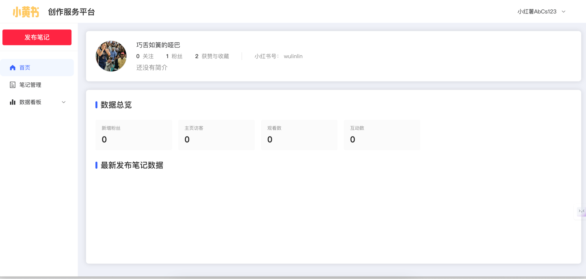
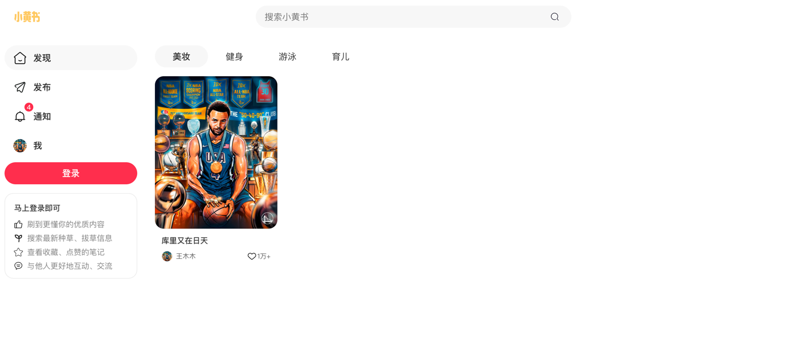

# small-yello-book

模拟小红书网页版的一个前端+后端项目。主要用于学习

创作平台：


小黄书web端：


# 1. 项目结构

```shell
gin-svc : 后端服务 基于gin开发的单体服务
ybook-admin: 前端项目: 创作者平台
ybook_site: 前段项目: 用户端小红书
```


# 1. 技术栈

## 前端

1. vue3.x
2. TS
3. Pinia
4. ElementPlus
5. Vite
6. Axios


## 后端单体服务

1. gin 
2. MySQL
3. Redis
4. Kafka
5. Canal
6. ES


# 2. 启动

## 前端

```shell
cd ybook-admin

npm i

npm  run dev
```


```shell
cd ybook_site

npm i

npm  run dev
```

## 后端
配置好MySQL, Redis, Kafka, Canal, ES，然后启动。主要是配置文件`/etc/dev.yaml`
```shell
cd gin-svc

go mod tidy

go run main.go
```


